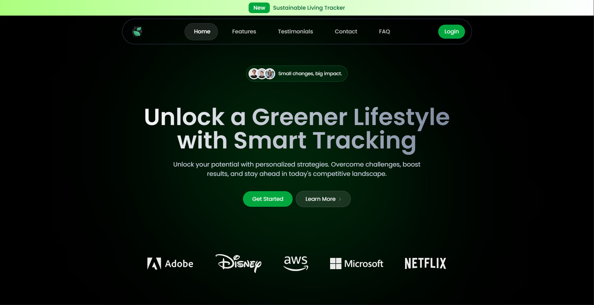
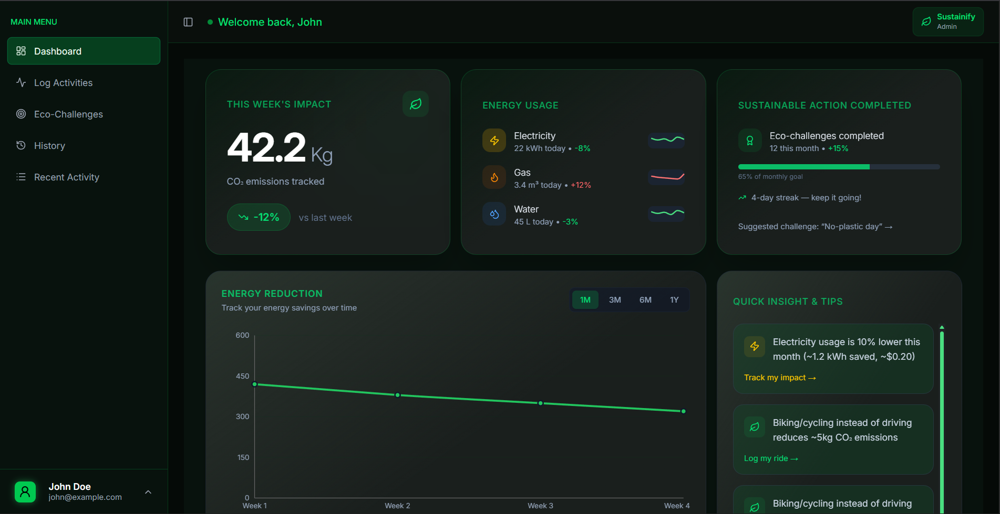
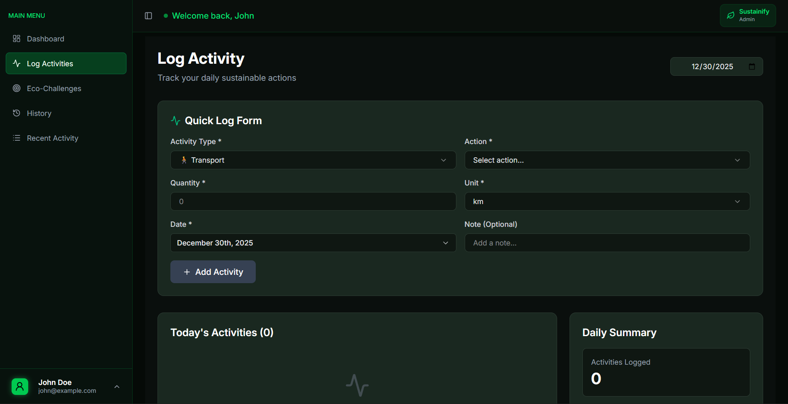
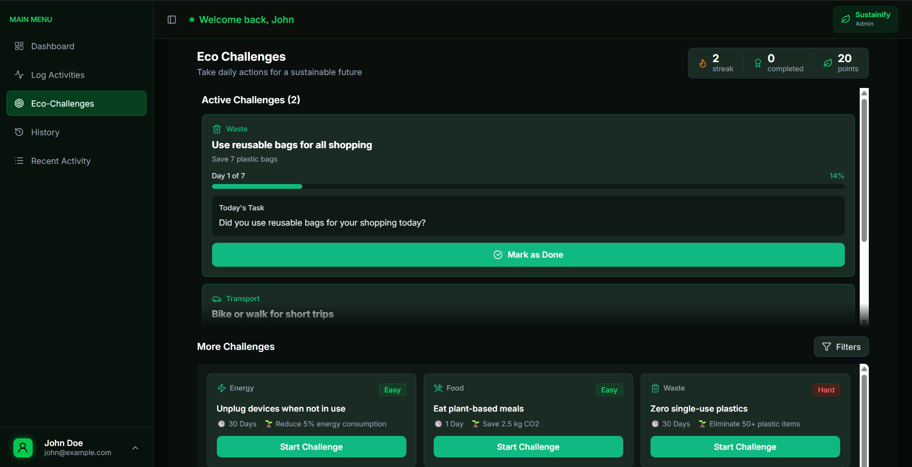

# 🌱 Sustainify

A modern web application that empowers users to track their environmental impact, log eco-friendly activities, and participate in sustainability challenges. Built with React, Node.js, and MongoDB.

## ✨ Features

- **User Authentication**: Secure signup and login with JWT-based authentication
- **Carbon Footprint Logger**: Track daily activities and their environmental impact:
  - 🚗 Car travel distance
  - 🥩 Meat consumption
  - ⚡ Electricity usage
- **Interactive Dashboard**: Visualize your carbon footprint with beautiful charts (weekly/monthly trends)
- **Eco-Challenges**: Complete sustainability challenges and earn eco-points:
  - Use public transport
  - Avoid plastic bottles
  - And more!
- **Activity History**: Review your logged activities and environmental impact over time
- **Responsive Design**: Works seamlessly on desktop and mobile devices
- **Real-time Notifications**: Get instant feedback on actions with toast notifications

## 🔗 Live Demo

🚀 **Live Application:**  
👉 https://sustainable-living-tracker.vercel.app

📦 **Backend API:**  
👉 https://sustainable-living-tracker.onrender.com

> ⚠️ Note: Initial load may take a few seconds as the backend is hosted on a free tier.

## 📸 Screenshots

### Home Overview


### Dashboard Overview


### Log Activities


### Eco Challenge


## 🛠️ Tech Stack

**Backend:**
- Node.js & Express.js
- MongoDB & Mongoose
- JWT Authentication

**Frontend:**
- React 19
- Vite (build tool)
- Recharts for data visualization
- Radix & Shadcn UI for accessible components
- Tailwind CSS for styling
- Framer Motion & GSAP for animations

## 📁 Project Structure

```
sustainable-living-tracker/
├── backend/
│   ├── src/
│   │   ├── app.js                 # Express app configuration
│   │   ├── constants.js           # App constants
│   │   ├── controllers/           # Request handlers
│   │   ├── db/                    # Database connection
│   │   ├── middlewares/           # Auth & error handling
│   │   ├── models/                # Database schemas
│   │   ├── routes/                # API routes
│   │   └── utils/                 # Helper functions
│   ├── index.js                   # Entry point
│   └── package.json
│
├── frontend/
│   ├── src/
│   │   ├── components/            # React components
│   │   │   ├── dashboard/         # Dashboard components
│   │   │   ├── home/              # Landing page components
│   │   │   ├── charts/            # Chart components
│   │   │   ├── secure/            # Auth context & protected routes
│   │   │   └── ui/                # Reusable UI components
│   │   ├── pages/                 # Page components
│   │   ├── api/                   # API client configuration
│   │   ├── hooks/                 # Custom React hooks
│   │   ├── lib/                   # Utility functions
│   │   └── App.jsx
│   ├── index.html
│   └── package.json
│
└── README.md
```

## 🚀 Quick Start

### Prerequisites

- Node.js (v16 or higher)
- npm or yarn
- MongoDB (local or Atlas)

### Installation

1. **Clone the repository**
   ```bash
   git clone <repository-url>
   cd sustainable-living-tracker
   ```

2. **Setup Backend**
   ```bash
   cd backend
   npm install
   ```

   Create a `.env` file in the `backend` directory:
   ```env
   PORT=5000
   MONGODB_URI=your_mongodb_connection_string
   JWT_SECRET=your_jwt_secret_key
   JWT_EXPIRY=7d
   REFRESH_TOKEN_EXPIRY=30d
   CORS_ORIGIN_DEV=http://localhost:5173
   CORS_ORIGIN_PROD=your_production_url
   ```

3. **Setup Frontend**
   ```bash
   cd ../frontend
   npm install
   ```

   Create a `.env` file in the `frontend` directory:
   ```env
   VITE_API_URL=http://localhost:5000/api/v1
   ```

### Running the Application

**Backend Development Server**
```bash
cd backend
npm run dev
```
The API will be available at `http://localhost:5000`

**Frontend Development Server**
```bash
cd frontend
npm run dev
```
The application will be available at `http://localhost:5173`


### Log an Activity
Access the dashboard at `/dashboard` and use the "Log Activities" section to record:
- Distance traveled by car
- Meat meal consumption
- Electricity usage

The system automatically calculates your carbon footprint based on predefined values.

## 📊 Dashboard Features

- **Overview**: View your total carbon footprint and environmental statistics
- **Log Activities**: Quick and easy logging of daily eco-activities
- **Eco-Challenges**: Browse available challenges and track your progress
- **History**: Detailed view of all logged activities with timestamps
- **Recent Activity**: Quick summary of your most recent entries

## 🧹 Code Quality

The project includes ESLint and Prettier for code consistency:

```bash
# Run linter
npm run lint

# Fix linting issues
npm run lint:fix

# Format code
npm run format
```

## 🤝 Contributing

We welcome contributions! Here's how you can help:

1. Fork the repository
2. Create a feature branch (`git checkout -b feature/amazing-feature`)
3. Commit your changes (`git commit -m 'Add amazing feature'`)
4. Push to the branch (`git push origin feature/amazing-feature`)
5. Open a Pull Request

Please ensure your code passes linting checks and follows the existing code style.

## 📝 License

This project is licensed under the ISC License - see the LICENSE file for details.
---

**Ready to make a difference?** Start tracking your sustainable lifestyle today! 🌍
